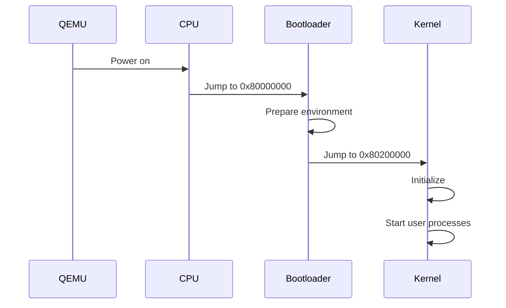

# LAB0.5
## 实验启动
首先进入实验代码的lab0，在目录下打开终端，运行如下代码，使qemu模拟的riscv架构CPU上电，但暂时不执行指令

```bash
qemu-system-riscv64        
    -machine virt
    -nographic         
    -bios default         
    -device loader,file=/home/lchos/Desktop/riscv64-ucore-labcodes/lab0/bin/ucore.img,addr=0x80200000        
    -s -S
```
运行指令后，由于CPU暂不执行指令，所以暂时没有输出

我们也可以直接使用`sudo make debug`指令来使qemu进入待debug状态，等待gdb连接。这两种方法作用是一样的，只不过`sudo make debug`集成度、自动化程度更高，而前面大段代码需要手动输入众多参数。

现在开始连接调试工具GDB。

在lab0目录下打开一个终端，运行`make gdb`，接入调试工具

终端会输出如下提示，此时gdb与qemu连接成功，进入调试阶段。
```bash
This GDB was configured as "--host=x86_64-linux-gnu --target=riscv64-unknown-elf".
Type "show configuration" for configuration details.
For bug reporting instructions, please see:
<https://github.com/sifive/freedom-tools/issues>.
Find the GDB manual and other documentation resources online at:
    <http://www.gnu.org/software/gdb/documentation/>.

For help, type "help".
Type "apropos word" to search for commands related to "word".
Reading symbols from bin/kernel...
The target architecture is set to "riscv:rv64".
Remote debugging using localhost:1234
```
## 实验进行
首先输入`x/10i $pc`，输出当前要执行的10条指令以验证程序流是否正常：
```bash
=> 0x1000:	auipc	t0,0x0
   0x1004:	addi	a1,t0,32
   0x1008:	csrr	a0,mhartid
   0x100c:	ld	t0,24(t0)
   0x1010:	jr	t0
   0x1014:	unimp
   0x1016:	unimp
   0x1018:	unimp
   0x101a:	0x8000
   0x101c:	unimp
```
我们通过单步调试工具`si`和`info register`查看寄存器值的变化，发现指令`auipc	t0,0x0`首先将当前程序计数器的高 20 位与立即数 0x0(相对偏移量) 相加，结果存入 t0 寄存器，即对t0进行赋pc值。

然后经过对a1与a0的操作后，`csrr a0,mhartid`指令从硬件线程 ID 寄存器 中读取当前硬件线程的 ID，存入寄存器 a0，这样可以让程序知道在哪个核上运行。

指令通过`ld	t0,24(t0)`对t0的值进行进一步更改，然后通过`jr	t0`进行跳转。

此时可以通过`info r t0`查看t0的值，是0x80000000

然后通过不断输入`si`指令，单步运行程序至0x80000000处，再通过`x/10i $pc`查看即将要被执行的10条指令：
```bash
   0x80000000:	csrr	a6,mhartid
   0x80000004:	bgtz	a6,0x80000108
   0x80000008:	auipc	t0,0x0
   0x8000000c:	addi	t0,t0,1032
   0x80000010:	auipc	t1,0x0
   0x80000014:	addi	t1,t1,-16
   0x80000018:	sd	    t1,0(t0)
   0x8000001c:	auipc	t0,0x0
   0x80000020:	addi	t0,t0,1020
   0x80000024:	ld	    t0,0(t0)
```
发现大部分是一些类似之前的对寄存器值的更改与加载操作，猜测应是在为执行位于0x80200000的第一条指令做准备。

此时我们在猜测是否会有一条像`jr	t0`那样的跳转操作，将程序带到`0x80200000`处，于是便开始了寻找

通过`x/100i 0x80000000`一次性显示更多程序以进行在大致判断跳转，在此基础上用`si`，`break *0x...`与`continue`不断进行调试观察程序执行位置，如此不断进行，我们寻找至`0x80001000`位置仍未发现跳转点，但发现指令大多为寄存器值的修改与装、加载，猜测有大量的准备工作要进行，于是便放弃寻找

然后直接将断点打至`0x80200000`处，用`continue`执行过去一探究竟

在执行`break *0x80200000`并'continue'时，发现终端弹出提示
```bash
Continuing.

Breakpoint 1, kern_entry () at kern/init/entry.S:7
7           la sp, bootstacktop
```
`kern_entry()`是操作系统内核的入口点，位于内核启动代码中。当程序执行到该地址(0x80200000)时，GDB命中了我们设置的断点，并显示了断点信息。这里显示的信息表明断点位于`kern_entry`函数，且该函数定义在`kern/init/entry.S`的第七行，内容是`la sp, bootstacktop`，这条指令用于初始化栈指针，使其指向启动时的栈顶。

以上结果正验证了`0x80200000`是操作系统程序入口点的猜想

执行至此后，发现qemu界面产生输出，看到了系统启动的标志，即ucore开始运行
```
   ____                    _____ ____ _____
  / __ \                  / ____|  _ \_   _|
 | |  | |_ __   ___ _ __ | (___ | |_) || |
 | |  | | '_ \ / _ \ '_ \ \___ \|  _ < | |
 | |__| | |_) |  __/ | | |____) | |_) || |_
  \____/| .__/ \___|_| |_|_____/|____/_____|
        | |
        |_|

Platform Name          : QEMU Virt Machine
Platform HART Features : RV64ACDFIMSU
Platform Max HARTs     : 8
Current Hart           : 0
Firmware Base          : 0x80000000
Firmware Size          : 112 KB
Runtime SBI Version    : 0.1
```
使用`x/10i $pc`查看位于此处的十条指令：
```bash
=> 0x80200000 <kern_entry>:	auipc	sp,0x3
   0x80200004 <kern_entry+4>:	mv	sp,sp
   0x80200008 <kern_entry+8>:	j   0x8020000a <kern_init>
   0x8020000a <kern_init>:	auipc	a0,0x3
   0x8020000e <kern_init+4>:	addi	a0,a0,-2
   0x80200012 <kern_init+8>:	auipc	a2,0x3
   0x80200016 <kern_init+12>:	addi	a2,a2,-10
   0x8020001a <kern_init+16>:	addi	sp,sp,-16
   0x8020001c <kern_init+18>:	li	a1,0
   0x8020001e <kern_init+20>:	sub	a2,a2,a0
```

`j 0x8020000a <kern_init>`跳转到地址 0x8020000a，这正是 kern_init 入口的地址。这一跳转指令直接进入内核初始化阶段，转移程序控制权，开始执行内核的初始化逻辑。

`li a1,0`将 a1 设为 0。a1一般是函数的第二个参数，我们推测此处是传递给内核初始化函数的一个初始值。

通过`<kern_entry>`与`<kern_init>`等函数可以看出，此时是操作系统的初始化阶段，ucore系统在此刻开始运行

同时，我们可以通过`info register`查看寄存器信息，看看准备工作的结果
```bash
(gdb) info register
ra             0x80000a02	0x80000a02
sp             0x8001bd80	0x8001bd80
gp             0x0	0x0
tp             0x8001be00	0x8001be00
t0             0x80200000	2149580800
t1             0x1	1
t2             0x1	1
fp             0x8001bd90	0x8001bd90
s1             0x8001be00	2147597824
a0             0x0	0
a1             0x82200000	2183135232
a2             0x80200000	2149580800
a3             0x1	1
a4             0x800	2048
a5             0x1	1
a6             0x82200000	2183135232
a7             0x80200000	2149580800
s2             0x800095c0	2147521984
s3             0x0	0
s4             0x0	0
s5             0x0	0
s6             0x0	0
s7             0x8	8
```
当系统加电时，硬件组件包括CPU、内存和外设被复位到初始状态。随后固件BIOS开始执行，进行基本的硬件检测，并定位Bootloader的位置。Bootlader负责加载操作系统内核到预定的内存地址，本实验中正是0x80200000，然后跳转到内核的入口点，开始执行内核代码。

内核的入口点代码负责初始化必要的寄存器和栈指针，用于设置系统运行的基础环境，随后执行跳转到内核初始化函数。而内核初始化一般会配置系统环境，如内存管理，设备驱动初始化、文件系统挂载等。初始化完成后就会创建第一个用户空间进程，一般是系统初始化进程。

在这之后，系统初始化进程会继续启动其他服务和应用程序，在窗口系统、网络服务等最后都启动完毕后，系统达到完全运行状态，准备用户登录与交互。
## 实验总结
总而言之，qemu要首先进行复位，并将程序跳转至`0x80000000`处,运行操作系统的bootloader，进行大量准备工作，然后运行至`0x80200000`处，加载操作系统的内核，完成操作系统的运行。系统启动过程涉及 bootloader 引导内核，并开始进行硬件初始化和内存设置，一环扣一环地进入用户态。这正对应着操作系统中启动过程的关键步骤。具体流程图如下所示：


通过本次实验，我们验证了 RISC-V 架构的 CPU 启动流程，并通过调试工具深入了解了引导程序和内核的执行。QEMU 模拟器帮助我们观察了寄存器的变化过程，展现了系统的初始化阶段。